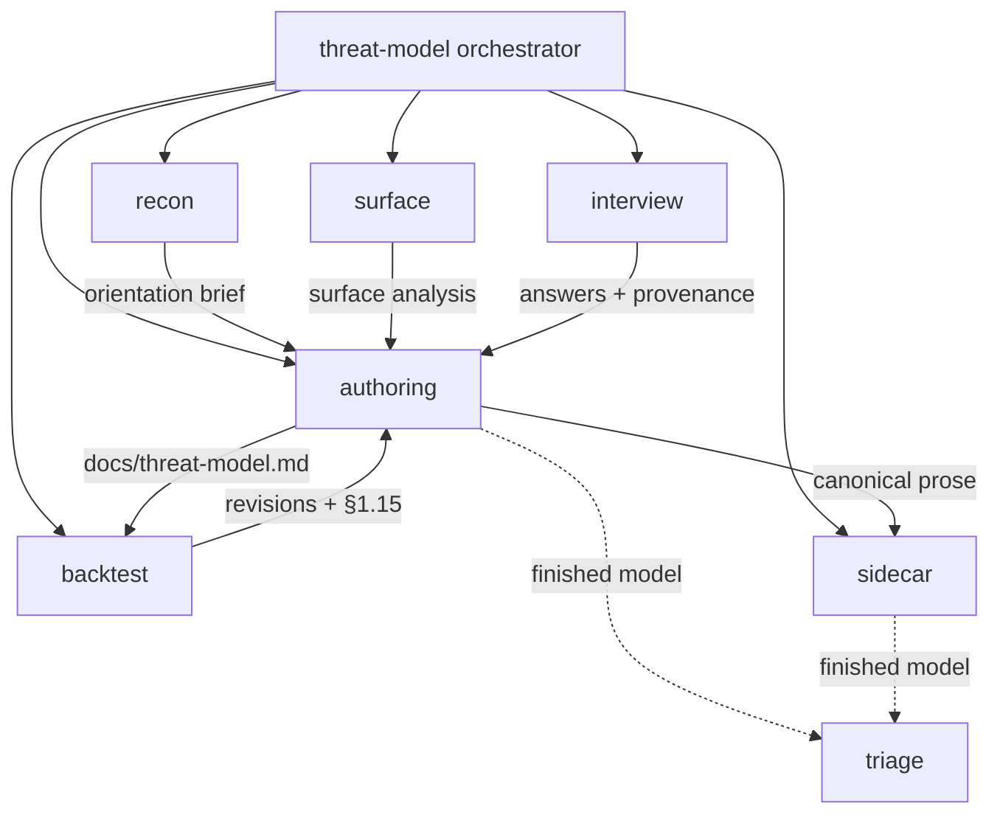

# Threat-model skill set

A set of [agent skills](https://agentskills.io/) that produce a **high-quality threat model** for a
targeted open-source repository or package — the *implicit security contract*
between a project and its downstream users (assumptions, guarantees, disclaimed
properties, misuses), **not** an audit, pentest, CVE list, or build-hygiene
checklist.

The skills and their shared references are the operational specification. The
bundle contains an **orchestrator plus independently invocable specialists**;
the orchestrator performs the handoffs rather than specialists invoking one
another.

## The deliverable is two artifacts

- **Unstructured** — a prose document (`docs/threat-model.md`) written to a fixed
  section structure, with structured tables embedded inline (per-input-operand trust
  table, contract-dimension matrix, disposition set, triager quick-start).
- **Structured** — a machine-readable companion (`threat-model.yaml`) that a
  triage pipeline or AI can consume.

## Skills

| Skill | Role | Phase |
| --- | --- | --- |
| [`threat-model`](./threat-model/SKILL.md) | **Orchestrator** — drives phases 3.1–3.7, owns iteration/sign-off, then runs publication gates. Holds the shared references. | all |
| [`threat-model-recon`](./threat-model-recon/SKILL.md) | Orient + mine `SECURITY.md`/prior docs; carve component families; classify project type. | 3.1–3.2 |
| [`threat-model-surface`](./threat-model-surface/SKILL.md) | Deep in-scope code pass → per-input-operand trust table + contract-dimension matrix + no-surprise side-effects inventory. | 3.3 |
| [`threat-model-interview`](./threat-model-interview/SKILL.md) | Clarifying-question waves (framed as proposed answers); provenance promotion; termination policy. | 3.4 |
| [`threat-model-authoring`](./threat-model-authoring/SKILL.md) | Draft the prose document with embedded structured tables; provenance tagging. | 3.5 |
| [`threat-model-backtest`](./threat-model-backtest/SKILL.md) | Validate the draft against the historical finding corpus; feed §1.15. | 3.6 |
| [`threat-model`](./threat-model/SKILL.md) | Iterate revisions, obtain sign-off, or publish unratified under the termination policy. | 3.7 |
| [`threat-model-sidecar`](./threat-model-sidecar/SKILL.md) | Emit + validate the machine-readable `threat-model.yaml`. | §1.19 |
| [`threat-model-triage`](./threat-model-triage/SKILL.md) | **Downstream reuse** — route one inbound finding to a single disposition. | consume |

## Call graph

Phase 3.7 repeats the interview ⇄ authoring ⇄ backtest loop until the maintainer
signs off or the termination policy publishes an **unratified draft**. Sidecar
generation and the finalize gate run afterward as publication gates.

## Shared references (owned by the orchestrator)

- [`principles.md`](./threat-model/references/principles.md) — what a threat model is/is not; the four-question framework; what to leave out.
- [`output-structure.md`](./threat-model/references/output-structure.md) — the §1.1–§1.19 document spec, provenance tags, and closed disposition set.
- [`question-bank.md`](./threat-model/references/question-bank.md) — reference questions, by wave.
- [`sidecar-schema.md`](./threat-model/references/sidecar-schema.md) — the `threat-model.yaml` schema.
- [`self-check.md`](./threat-model/references/self-check.md) — the four finalize gates.
- [`worked-example.md`](./threat-model/references/worked-example.md) — a zlib flavor sketch.

## Usage

Ask the agent to *"produce a threat model for `<repo/package>`"* to invoke the
orchestrator, or call a specialist directly (e.g., *"triage this scanner finding
against the threat model"* → `threat-model-triage`). Specialists are
independently invocable within this bundled skill set and may rely on its shared
references; the orchestrator sequences them and folds their artifacts into the
running draft.
