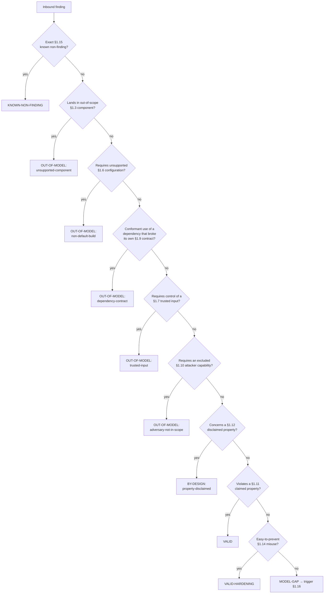

# Output structure — the threat-model document

This is the canonical section-by-section specification for the root-level
**deliverable** (`threat-model.md`). The `threat-model-authoring` specialist
writes to this structure; every other specialist feeds one or more sections.

Use these sections, in this order. Rename to fit a project's house style, but
cover the same ground. Each section is either substantive or explicitly marked
`Not applicable — <reason>`. Empty headings are a smell.

**Marking a section Not applicable.** A section counts as N/A only when its
*entire* body is the single line `Not applicable — <reason>`. Inside a
substantive section, say what is absent in plain words ("this project is not
distributed, so there is no Byzantine-participant actor") rather than writing
"not applicable" mid-section. Tooling reads the first line to decide whether a
section is N/A, and an N/A section is skipped by the sidecar coverage check — so
a stray "not applicable" in a long §1.10 can quietly excuse the sidecar from
carrying any adversaries at all.

Two consumers must be able to use every section without re-deriving the
reasoning:

- the **downstream integrator**, deciding which threats they now own; and
- the **triager**, classifying an inbound report/finding as valid, out of
  model, or disclaimed — and citing the section that justifies the call.

**Write it plainly.** Both readers are busy professionals, not an academic
audience. Use short, direct sentences (one idea each), plain words, active voice,
and real verbs instead of nominalizations; break piled-up noun stacks and long
inline lists into short bullets or table rows. Target the reading level of good
developer documentation, not a research paper. Precision and readability are not
in tension — keep every operand and provenance tag, just say it in fewer, plainer
words. See "Write so a human can read it" in
[principles.md](principles.md).

---

## Provenance tags (used throughout)

Every non-trivial claim carries exactly one inline tag:

| Tag | Meaning |
| --- | --- |
| *(documented, source)* | Stated in a maintainer-authored public source: project docs, headers, FAQ/manpage, `SECURITY.md`, release rationale, or an issue ruling. **Cite a locator, not a file.** The tag names the file *plus* the function, macro, or struct it documents; a named doc section (`FAQ #36`, `README "Thread safety"`); or a quoted phrase of twelve words or fewer. A bare filename is not a citation — a triager closing a report on `` `zlib.h` `` alone cannot check the claim against a 1,900-line header. |
| *(maintainer, YYYY-MM)* | Stated by a maintainer in response to a question from this process. Always dated, e.g. *(maintainer, 2025-03)*. |
| *(assumption, QN)* | A **reasonable default the model author is willing to act on now**, chosen conservatively where docs are silent and no maintainer answer exists — e.g. "no thread-safety is guaranteed for a mutable view" when the Javadoc states none. Still unratified: `QN` **must** resolve to a §1.18 ratification item, and review promotes it to **maintainer**. Distinct from **inferred** only in that the author has committed to a default rather than left the question open. |
| *(inferred, QN)*   | Reasoned from code structure, absence of a feature, or domain knowledge, **without** a committed default — genuinely open. `QN` **must** resolve to the matching open question in §1.18. |

Do **not** invent hedge-tags ("*(implicit)*", "*(documented in purpose)*",
"*(generally known)*"). If a claim is not clearly **documented** or
**maintainer**, it is **assumption** (author commits to a conservative default)
or **inferred** (question left open). Retain tags in the published version — a
disposition that closes a report cites *(maintainer, 2025-03)*, and bare prose
is not defensible.

**A parenthesized kind is always a claim tag.** Any of the four kind words —
documented, maintainer, assumption, inferred — wrapped in parentheses is read by
tooling wherever it appears, so
every one of them must carry its source, date, or `QN`. When you need to *name* a
tag kind as vocabulary — "an **inferred** claim may only escalate" — write it in
**bold**, never in tag syntax. Writing it in tag syntax produces a detail-less
tag that inflates the §1.1 confidence tally, breaks the Q-ID mapping, and fails
validation. This document follows its own rule: every parenthesized tag below is
a worked example carrying a detail, and every mention of a kind as a concept is
bold. Copy that habit.

**Assumptions vs inferences — the routing difference.** Both are unratified and
both register a §1.18 item. They differ only in what the **triage policy** lets
them do (see §1.1 and §1.17): under `strict` an **assumption** behaves exactly
like an **inferred** claim — it may escalate but never close. Under `relaxed` an
**assumption** may additionally license the **low-blast-radius** closes
(`trusted-input`, `adversary-not-in-scope`, `unsupported-component`,
`non-default-build`, and a *non*-security-critical `property-disclaimed`), each
emitted as a **provisional** close that a reporter can re-open on challenge. An
**assumption** **never** licenses `KNOWN-NON-FINDING`, a security-critical
`property-disclaimed`, or `dependency-contract`, and **inferred** never closes
under either policy. Prefer **assumption** over **inferred** only when the safe
default is genuinely clear; when a real guarantee might exist, leave it
**inferred**.

**Disclaim-by-default for demonstrably-absent guarantees.** When the code and
docs show a family-wide guarantee is simply *not made* (no stated thread-safety,
no resource bound, no failure-atomicity guarantee), record that as a
*documented* **disclaimer** in §1.12 — the absence is verifiable in the public
API, so it is *(documented, source)*, not an open question. Disclaiming the safe
(no-guarantee) direction pushes the responsibility to the caller and is the
primary lever for reducing `MODEL-GAP` without weakening the closure-safety
rule. Three rules bound that lever.

**Absence of a guarantee is not absence of a behavior.** These are different
claims and they do not carry the same authority:

- **No guarantee is stated** — the docs describe the API and say nothing about
  thread-safety, resource bounds, or failure atomicity. The project has declined
  to promise it. Record a §1.12 disclaimer, *(documented, source)*.
- **No behavior was observed** — you scanned the sources and found no socket, no
  `getenv`, no child process, no signal handler. The project has *not* promised
  to keep it that way, so this is a §1.5 inventory row, not a documented
  contract. Tag it *(assumption, QN)* when an exhaustive scan of the shipped
  sources of the supported build establishes it. Tag it *(inferred, QN)* when the
  scan cannot be exhaustive — hand-written assembly, generated code, `dlopen` or
  another dynamic dispatch, an `#ifdef` branch you did not read, or a dependency
  that could do it on the project's behalf — and name the specific hole in the
  question.

**An absence claim carries only as far as you looked.** The tag names the
artifact and the section actually searched, and an absence established for one
component or entry point may never be extended to another — each component needs
its own check. If a claim generalizes past the component, family, or dimension
its source names, it is *(assumption, QN)*, never **documented**, and it carries
a §1.18 question asking the maintainer to confirm the wider scope. A FAQ answer
about the compressor does not disclaim anything about the decompressor.

**"Plausibly exists" is a test, not a feeling.** Reserve `unresolved` /
**inferred** for dimensions where a guarantee plausibly exists but could not be
confirmed — and a guarantee plausibly exists when the project has historically
fixed reports of that class, or when a guarantee already documented implies it.
In that case the row is `claimed` with narrower conditions, or `unresolved` with
a §1.18 question offering the maintainer an explicit choice. It is never
`disclaimed` on the strength of silence alone.

Implementation and tests may support an inference, but do not by themselves
turn an unwritten contract into **documented** provenance. A conformance test is
documented evidence only when the project publicly identifies it as normative.

---

## 1.1 Header

- Project name, version/commit, date, author(s) of the threat model.
- **Generation metadata** — when the model is produced with AI or automated
  assistance, record the tooling so a reader can weigh the draft:
  - **Model/agent** — the producing model or agent, name + version (e.g.
    "Claude Opus 4.8"). Mark "human-authored" when no model was involved.
  - **Effort level** — the reasoning/effort setting the run used (e.g. low /
    medium / high, or the provider's own label), since it bears on depth and
    confidence.
  - **Plugins/skills** — the skills, plugins, and MCP servers that drove
    production (the threat-model orchestrator and each specialist invoked, plus
    any external tooling such as a binlog or repo-search server). List what was
    actually used, not the full catalog.
- **Version binding** — the model is versioned alongside the project. A report
  against version *N* is triaged against the model as it stood at *N*, not HEAD.
  The modeled version is a **published, committed** ref (a release tag or merged
  commit), never the author's working tree: uncommitted changes, unmerged
  branches, and draft PRs are out of scope because a downstream reader cannot see
  them.
- **Reporting cross-reference** — one line: §1.11 (claimed-property) findings
  are reported per the project's disclosure channel; §1.3 / §1.12 findings are
  closed citing this document.
- **Status** — draft / unratified draft / under maintainer review / accepted,
  with date. For every status, restate the closure constraint in one line: an
  **inferred** claim may escalate a report but never close it, and an
  **assumption** closes only what the declared triage policy permits.
- **Triage policy** — one line declaring `strict` or `relaxed` (default
  `strict`), so a triager knows what an **assumption** is allowed to do. Under
  `strict`, assumptions escalate only; under `relaxed`, they may license the
  low-blast-radius closes provisionally (see §1.17). The security-critical floor
  holds under both policies.
- **Provenance legend** — the one-line key for the four tags above.
- **Glossary pointer** — inline a short plain-language glossary (or copy
  [glossary.md](glossary.md) alongside the model and link that copy) so a
  non-expert reader can decode
  dispositions, sinks, disclaimed properties, and provenance without prior
  security-modeling background. Do not link the skills-repo glossary path from
  the published model — it will not resolve in the target repo.
- **Draft confidence** — a count of **documented** / **maintainer** /
  **inferred** claims (e.g., "29 documented / 0 maintainer / 30 inferred"). When
  the model uses **assumption** tags, append "/ N assumption".
- **Backtest note** — written by phase 3.6, never by the drafting phase. State
  corpus size and cluster count, how many items carry a **real historical
  outcome** versus were synthesized, the disposition histogram, how many
  historically-fixed items route to a closing disposition (the fail-safe
  figure; the target is zero), the share of the corpus that closes, and any contradictions with their
  §1.18 questions. Until 3.6 runs, the field reads exactly
  `- **Backtest note**: _pending phase 3.6_`; publishing with that placeholder
  still in place is a gate failure, and so is replacing it with a claim the
  backtest did not produce. If no historical record was reachable, use the exact
  sentence *"no historical corpus was available; the backtest routed N synthesized cases only"* rather than presenting synthesized cases as
  history — it is the one honest exit the validator recognizes.
- **Sibling models** — if the repo is covered by more than one model, name the
  others and their scope.
- One-paragraph plain-language description of the project's purpose.
- **Triager quick-start** — a boxed routing algorithm:

  > Given an inbound finding:
  > 0. Read the triage policy declared above (`strict` or `relaxed`). It decides
  >    what an **assumption** is allowed to do in step 8.
  > 1. Locate the sink → look up its row in the §1.7 input-trust table (or the
  >    §1.8 output statement, for "downstream may assume X" findings).
  > 2. Locate the contract dimension → for numeric domain and representational
  >    limits, failure/exception atomicity, recursive or cyclic topology,
  >    callback/collaborator execution, serialization/reconstruction,
  >    reference/object lifecycle, concurrency/reentrancy, or resource
  >    complexity, follow the component's matrix row to its owning claim. Use the
  >    same dimension names the §1.7 matrix uses, including any project-specific
  >    `x-` dimensions.
  > 3. Check the required attacker capability and control kind against §1.7/§1.10;
  >    distinguish data from size, type/class, callback code, topology,
  >    collaborator implementation, and serialized state.
  > 4. Check the affected component against §1.2/§1.3, and any required build
  >    flag against §1.6.
  > 5. If the root cause is in a dependency, apply §1.9.
  > 6. Apply §1.17's precedence order, beginning with an exact §1.15 known-
  >    non-finding match.
  > 7. Assign exactly one §1.17 disposition, citing the licensing section and
  >    its provenance. If
  >    none fits, assign `MODEL-GAP` and trigger §1.16 — do not improvise.
  > 8. **Before closing, check the provenance of the claim that licenses the
  >    close.** This gate applies to every `OUT-OF-MODEL: *`, `BY-DESIGN: *`, and
  >    `KNOWN-NON-FINDING` route; `VALID` and `MODEL-GAP` are unaffected.
  >    - **documented** or **maintainer** → close.
  >    - **inferred** → **escalate, never close**, under either policy.
  >    - **assumption** → escalate under `strict`. Under `relaxed` it licenses a
  >      **provisional** close for `trusted-input`, `adversary-not-in-scope`,
  >      `unsupported-component`, `non-default-build`, or a *non*-security-critical
  >      `property-disclaimed` — tag the close with the licensing `QN`, keep the
  >      §1.18 item open, and re-open on a reporter challenge.
  >    - An **assumption** never closes `KNOWN-NON-FINDING`, a security-critical
  >      `property-disclaimed`, or `dependency-contract`, under either policy.
  >    - A disclaimer resting on the **absence** of a statement never closes a
  >      security-critical report at all. See §1.17.
  >    Record the outcome as `closed`, `escalated`, or `provisional` (§1.17).

## 1.2 Scope and intended use

- Primary intended use cases — concrete ("in-process compression of application
  data" beats "general compression library").
- Deployment contexts (in-process library? CLI? daemon? embedded? kernel?).
- Caller expectations and trust level. For a **network service/daemon**, split
  the role into *client* (untrusted), *operator/admin* (trusted for the
  instance), and *peer* (authenticated but adversarial); each gets rows in §1.7
  and actors in §1.10.
- **Component-family table** (lead with it): family name, representative
  entry point, whether it touches anything outside the process (fs, network,
  env, child processes), and in/out of this model. Anything out here reappears
  in §1.3 with the reason.

## 1.3 Out of scope (explicit non-goals)

- Use cases the project does not aim to support (state even the obvious ones).
- Threats not defended against, each with a reason ("not a security boundary",
  "out of layer", "unsolvable at this layer").
- Shipped-but-unsupported code (`contrib/`, `examples/`, `vendor/`,
  `third_party/`, demos, generated bindings) with an explicit policy.
- **Check each exclusion against the build, not the directory name.** If the
  build compiles anything out of an excluded directory — often a default-on,
  platform-conditional option — name the exact path, say which platform or flag
  pulls it in, and treat that path as **in scope** there. Put the flag in §1.6.
  An unqualified exclusion of a directory the build reaches into fails open:
  `unsupported-component` is second in the §1.17 precedence order, so a real
  report against shipping code closes before anything else is checked.

## 1.4 Trust boundaries and data flow

- Where the trust boundary sits.
- The path data takes, expressed as trust transitions. Skip (say so) if purely
  computational with no meaningful transitions.
- **Diagram when roles multiply** (≥3 roles): a simple boxes-and-arrows
  data-flow diagram (ASCII or Mermaid) with boundaries drawn on it. A single-
  boundary in-process library needs only prose.
- **Reachability precondition per component** — the condition a finding must
  meet to matter (e.g., "a finding in `inflate.c` is in-model only if reachable
  from the compressed input bytes").

## 1.5 Assumptions about the environment

- OS, runtime, hardware; concurrency (thread-safety, reentrancy, signal-safety);
  memory model (allocator, alignment); time/clock; filesystem/network/peripheral.
- **No-surprise side-effects inventory** — what the project does *not* do to its
  host (sockets? child processes? signal handlers? env reads? stdout/stderr?
  global locale/FPU state? process-wide mutation?). These are **negative
  claims** about observed behaviour, so tag them by how good your scan was, not
  by a default: *(assumption, QN)* when you scanned the shipped sources of the
  supported build exhaustively, *(inferred, QN)* when the scan could not be
  exhaustive — naming the hole (assembly, generated code, `dlopen`, an unread
  `#ifdef` branch, a dependency acting on the project's behalf). Either way a
  **wave-1/2 confirmation target**. These are rarely **documented**: the project
  never promised to keep the behaviour absent.

## 1.6 Build-time and configuration variants

- Compile-time defines, feature flags, runtime knobs that **change which
  security properties hold**: default, effect on the model, whether discouraged.
  If none, say so.
- **Support posture, not defaultness, controls routing.** For every security-
  relevant configuration, record whether it is supported for the modeled use.
  A defect in a supported configuration is in-model even when that
  configuration is non-default. `OUT-OF-MODEL: non-default-build` applies only
  when §1.6 explicitly marks the required configuration dev-only, discouraged
  for the modeled exposure, or otherwise unsupported. (The disposition name is
  retained for compatibility; its meaning is **unsupported configuration**.)
- **The insecure-default case** — when the shipped default voids a §1.11
  property, the maintainer must rule whether that default is a supported
  production posture (`VALID`) or explicitly dev-only/unsupported
  (`OUT-OF-MODEL: non-default-build`, with the required production setting in
  §1.13). This is a **wave-1** question.

## 1.7 Assumptions about inputs

- What inputs are accepted and from where.
- **Per-input-operand trust table** — one row per direct parameter and each
  security-relevant indirect input (stream contents, inherited handle state,
  connection metadata) of every public entry point: `Entry point | Input
  operand | Attacker-controllable? | Control kind | Caller
  must enforce | Provenance`. `Control kind` distinguishes data, size/rate, type/class,
  callback/code, object-graph topology, collaborator implementation,
  resource-name, and serialized state. Project-specific kinds use an `x-`
  prefix.
  For a network service the first column is the route/endpoint or protocol
  message, and rows cover headers/connection metadata as well as bodies. Prose
  is not sufficient — findings are reported against specific sinks. If the
  surface was too large to table fully (per the phase-3.3 timebox), say which
  portion is covered and mark the remainder **inferred**.
- **State the coverage as a count, and never claim completeness you have not
  counted.** "38 of 97 exported functions have rows; the 59 without are
  accessors and `_z` size variants" is a coverage note. "Every public entry
  point is covered" is a claim about a set, and it is checked against the header
  it names. Get it wrong and it becomes the most misleading sentence in the
  document: a triager who cannot find an entry point concludes you considered it
  and scoped it out, when in fact nobody looked. An honest partial table is
  worth more than a false complete one, so if you are unsure, give the number.
- Size/shape/rate assumptions (bounded? streaming? memory-mapped?).
- **Contract-dimension matrix** — one row per applicable dimension for every
  in-scope component family. Required dimensions are numeric domain and
  representational limits; failure/exception atomicity; recursive/cyclic
  topology; callback/collaborator execution; serialization/reconstruction;
  reference/object lifecycle; concurrency/reentrancy; and resource complexity.
  Each row is `Component | Dimension | Status | Conditions / boundary |
  Routes to | Provenance`; status is `claimed`, `disclaimed`, `N/A — reason`,
  or `unresolved`. Each row routes to the owning §1.3/§1.5/§1.7/§1.10/§1.11/§1.12
  claim or a proposed-answer §1.18 question. Add domain-specific rows such as
  Unicode normalization or probabilistic-result semantics where applicable.
- For stateful APIs, state the postcondition after validation, allocation,
  callback, or collaborator failure: unchanged, partially committed,
  best-effort cleanup, or unspecified.

## 1.8 Assumptions and guarantees about outputs

The mirror of §1.7 — the project's output is somebody else's input. Per output
channel (return values, filled buffers, files, network responses, callbacks):

**Table shape.** One row per output channel, and the **Provenance column is
required** — the same rule §1.7 already carries:
`Output channel | Component | Taint | Downstream must not assume | Provenance`.

- **Taint** — the default one-liner for parsers/decoders/decompressors, worth
  stating verbatim: *"Output is exactly as untrusted as the input it derives
  from; no sanitization, normalization, or encoding is performed."*
- **Structural invariants that ARE guaranteed** (valid UTF-8, depth/size caps,
  matching length fields, round-trip) — promote each to §1.11 with a symptom
  and tier, and reference the property ID from the row.
- **What downstream must NOT assume** (canonical form, dedup, ordering, no NUL
  bytes, safety for HTML/SQL/shell). One-line disclaimers that pre-empt misuse.
- A channel whose content is **assembled** rather than passed through — an error
  string built from a caller-supplied path, a message that interpolates a
  filename — is not "constant text". Say what goes into it, because the reader's
  escaping decision depends on it.
- If there is genuinely no externally consumed output, mark N/A with reason.

**Never answer a citation problem by deleting the column.** If a Provenance cell
cannot be filled with a locator, open the file and find one, or tag the row
**inferred** with a §1.18 question. Dropping the column converts a visible
gap into an invisible one, and the claims in it keep their authority while
losing their evidence.

## 1.9 Assumptions about dependencies

- **Per-dependency trust statements** — one per direct runtime dependency: the
  property relied on, and whether a violation is triaged here or upstream.
- **Vendored/bundled copies** compiled into supported artifacts: covered at the
  pinned version or deferred upstream? Who ships the fix?
- **Routing rule** — a dependency failing its own documented contract (this
  project's usage conformant) → `OUT-OF-MODEL: dependency-contract`, forwarded
  upstream. This project misusing a dependency contract → in-model.
- **Zero-dependency claim** — if none beyond libc/runtime, say so explicitly (a
  strong negative claim; usually **inferred** at first — early question wave).

## 1.10 Adversary model

**Table shape.** One row per actor, Provenance column **required**:
`Actor | In scope? | Capabilities held | Capabilities excluded | Goals | Provenance`.

- Every in-scope actor needs a non-empty **Capabilities excluded** cell. That
  cell is what `OUT-OF-MODEL: adversary-not-in-scope` cites, so a model without
  it cannot use the disposition — and per the §1.1 provenance gate, an untagged
  row cannot close a report at all.
- Who the attacker is; capabilities they have and lack; what they are trying to
  do; which actors are explicitly out ("a caller controlling the process has
  already won").
- Name the **deployment context** the actor list assumes. A context whose
  adversary differs from that baseline — an enclave where the privileged host is
  hostile, a shared host, a sandboxed plugin — gets its own row or is marked
  unsupported in §1.3. Do not advertise a context in §1.2 and silently give it
  the baseline's adversary.
- For **distributed/replicated/consensus** systems, include the
  *authenticated-but-Byzantine participant* as a distinct actor and state the
  honest-fraction threshold (`< n/3`, `< ½ stake`); put the threshold in the
  §1.11 conditions and its complement in §1.3.

## 1.11 Security properties the project provides

For each property state **five things**: (1) the property + conditions;
(2) **violation symptom**, from the closed set below; (3) **severity tier**
(security-critical → CVE, vs correctness-only); (4) provenance tag; (5) **what
voids it** (see below).

**Violation symptom — closed vocabulary.** Pick from `crash`, `oob-read`,
`oob-write`, `buffer-overflow`, `use-after-free`, `uninitialized-read`,
`info-leak`, `hang`, `unbounded-allocation`, `wrong-output`,
`bad-data-accepted`, `integrity-bypass`, `data-race`, or an `x-` value for
something genuinely outside these. Say the symptom, then explain it in the row
if the bare word is not enough.

**A memory-safety symptom needs a code citation, not a doc quote.** When the
symptom is `oob-read`, `oob-write`, `buffer-overflow`, or `use-after-free`, the
evidence must include a `file:line` pointing at the write or access path.
Documentation promises **return codes**; only code shows **memory outcomes**. A
property whose symptom is an out-of-bounds write and whose only evidence is a
sentence from the manual is overclaiming by construction — the manual almost
certainly said "returns an error", and the memory language was supplied by the
author.

This closes the exit that squeezing the other fields leaves open. If the
provenance tag is policed and the tier is policed, an exaggeration relocates to
whichever field is not — and the symptom field is what decides whether a report
is a vulnerability. Check that the symptom is the worst thing the *cited
evidence* actually establishes, not the worst thing the property sounds like it
might prevent. Cover memory/safety, correctness,
promoted structural output invariants, distributed-system properties (with the
honest bound), and resource properties — **state the threshold** ("super-linear
in input is a bug; constant-factor blowup is not"; "a hang is a bug; slow is
not"; or "no resource guarantee at all"). A property counts only if the project
committed to it (normative docs,
maintainer-authored public rulings, explicitly normative conformance tests, or a
maintainer answer). Implementation/tests that merely suggest a contract remain
**inferred**. Do not invent properties.
Promote every `claimed` contract-dimension row here or to the environment/output
section that owns it; no claimed row may exist only in the matrix.

**Every property states what voids it — from the code.**
A guarantee is rarely unconditional. The caller can usually turn it off: an API
call that relaxes a check, a build flag that removes one, a mode that trades the
check for speed. A property published without its off-switches is the most
dangerous thing in the model, because a triager reads it as absolute and answers
`VALID` to a report whose real first question was "did you disable it?"

**Required when the violation symptom is consequential** — any memory outcome
(`oob-read`, `oob-write`, `buffer-overflow`, `use-after-free`,
`uninitialized-read`), plus `bad-data-accepted`, `integrity-bypass`, and
`unbounded-allocation`. Elsewhere it is optional: one line saying no switch
affects it is plenty.

Keyed on the **symptom**, deliberately — not the tier, and not everything.
Tier fails because the property whose off-switch matters most is often tiered
`correctness-only` precisely because the model has not noticed the switch yet
(an integrity check a caller can disable is the standing example), and because
an author could then drop the obligation by relabelling the tier. Requiring it
everywhere fails too: asking eight properties for off-switches produced three
confidently false negatives, and the volume is what made them sloppy. The
symptom predicts whether a switch changes the triage answer, and it already
constrains the tier — so softening the symptom to dodge this also softens the
claim, which is the right trade.

- List each switch as `<what the caller does> — <file>:<line>`, pointing at the
  **statement that implements it**. In zlib, `inflate.c:1393` — the line
  `state->wrap &= ~4` that clears the check-value bit — is a citation.
  `inflate.c:1385`, the `inflateValidate` signature, is not: it names the
  function without showing what it does. Nor is a comment saying the function
  relaxes checking, nor the `#ifdef` above it. Comments record intent; the
  statement records behaviour, and only behaviour voids a guarantee.
- **"Nothing voids it" must come with the search, written as a command.** Not
  "searched every `ZEXPORT` in `zlib.h`" — that is a claim about a search, and
  it cannot be checked. Write the command and its result:

  > *Voided by*: nothing. Search: `grep -rn 'ASMINF\|LIT_MEM\|_STRICT' *.c *.h configure` — 0 hits outside `inffast.c`.

  A negative claim is the cheapest thing in the model to write and the easiest
  to get wrong, so it is the one place the model owes the reader a command they
  can paste. State the file set the command covers, and make that set **what
  the supported build actually compiles** — not one or two files you had open.
  Every false negative found so far failed the same way: the search was scoped
  to files that could not contain the answer, so a real off-switch in a third
  file went unseen while the claim read as thorough.
- **This does not change the property's provenance tag.** The project promised
  the guarantee on documented or maintainer authority; the code tells you where
  the promise stops. Those are different questions with different sources, which
  is why finding a void needs no new tag kind.
- A switch that is a build-time flag also gets a §1.6 row: it changes which
  security properties hold, which is exactly what §1.6 is for.
- Search for these deliberately. They are easy to miss because they are not
  *inputs* — no attacker operand appears, so an input-shaped reading of the API
  walks straight past them. Look for functions whose whole purpose is to relax,
  undermine, skip, permit, or trust, and for flags named for strictness.

**Worked routing examples.** Close §1.11 with two to four one-line examples,
exported from the phase-3.6 backtest and de-identified: what was reported, the
sink, the capability the attacker needs, the symptom, the disposition, and the
claim that licenses it. **At least one must route `VALID`.** These teach the
§1.1 algorithm faster than the prose does, and the `VALID` row is load-bearing:
a triager whose only examples are closes learns that the model exists to say no.
Budget about 15 lines, and carry no CVE IDs, reporter names, or dates — the
corpus stays producer-side.

Every closing row carries its status (§1.17); `VALID` takes none.

| Reported | Sink | Attacker needs | Symptom | Routes to | Licensed by |
| --- | --- | --- | --- | --- | --- |
| Crafted stream drives a write past the output buffer | `inflate` | the compressed bytes only | OOB write | `VALID` | `P-OUTPUT-BOUND` |
| Fuzzer OOM: small input expands to gigabytes, no output cap | `inflate` | the compressed bytes only | Unbounded allocation, OOM | `KNOWN-NON-FINDING` **(closed)** | `KNF-BOMB` |
| Scanner hit inside `contrib/` | `contrib-samples` | n/a | any | `OUT-OF-MODEL: unsupported-component` **(escalated)** | §1.3, still **inferred** |

Note the second row: a §1.12 bomb disclaimer would also close it, but an exact
§1.15 match is precedence rule 1 and fires first. Pick examples that show the
precedence and the provenance gate doing real work, not just the easy cases.

**An unratified property — **inferred** or **assumption** — may not carry a `security-critical` tier.** The
closure constraint gates the routes that close a report, but `VALID` is a
publication too: an integrator reads §1.11 and builds on it. Publishing a
guarantee the project never made, at the tier that says "we treat a violation as
a CVE", is worse than publishing a gap, because the gap is visible and the false
guarantee is not. If the guarantee is unratified, leave the matrix row
`unresolved` and put the candidate in §1.18 as an explicit choice between a
§1.11 guarantee and a §1.12 disclaimer. Do not list it as a claimed property
with a hedge attached.

## 1.12 Security properties the project does *not* provide

The companion to §1.11 and the highest-value section for an integrator. State
each plainly. Call out **"false-friend" properties** separately — features that
look like a security property but are not ("X is provided for A; sometimes
mistaken for B, which it does not satisfy": CRC≠MAC, non-crypto hash≠collision-
resistant, PRNG≠CSPRNG, resource-"sandbox"≠isolation). Name the **well-known
attack classes** for this category the project leaves to the caller (compression
bombs, XXE, ReDoS, billion-laughs) — one sentence each.
Promote every `disclaimed` contract-dimension row here or to §1.3. State
unsupported edge semantics plainly: for example, whether oversized cardinality,
cyclic object graphs, callback exceptions, reconstructed polymorphic state, or
weak-reference clearing are caller-owned.
**Disclaim demonstrably-absent guarantees here rather than leaving them
`unresolved`.** If the public API makes no thread-safety, resource-bound, or
failure-atomicity guarantee, say so as a **documented** disclaimer — the absence
is verifiable, and a disclaimer lets a matching report close as
`BY-DESIGN: property-disclaimed` instead of routing to `MODEL-GAP`. Keep
`unresolved` only for dimensions where a guarantee plausibly exists but was not
confirmed.

**Table shape.** One row per disclaimer:
`ID | The project does not provide | Conditions / boundary | Tier | False friend? | Provenance`.

- **Conditions / boundary** — where the disclaimer stops. A disclaimer with no
  boundary is the one that over-closes: name the components and operations it
  covers, and say which neighbouring behaviour it does *not* cover.
- **Tier** is required on every row and takes the §1.11 vocabulary,
  `security-critical` or `correctness-only`. **Tier a disclaimer by the worst
  impact of a report it would close, not by how the project feels about the
  property.** Three worked calls: unbounded output from a decompressor is
  `security-critical`, because the reports it closes are memory-exhaustion
  reports; stability of error codes across releases is `correctness-only`;
  byte-identical compressed output across versions is `correctness-only`.
- A missing tier is not a neutral omission. Triage **fails closed** on it: an
  untiered disclaimer escalates every matching report instead of closing it.
  `correctness-only` is the cell that grants an **assumption** permission to
  close under `relaxed`, so it is a decision you are making, not a default you
  are accepting. Fill every cell.

## 1.13 Downstream responsibilities

Action-oriented contract of what the *user* (embedding app, or operator for a
service) must do for §1.5–§1.10 to hold. Every §1.6 dev-only knob reappears as
"set X before exposing the service"; every risky §1.8 "must not assume" becomes
a positive obligation ("sanitize decompressed output before rendering").

## 1.14 Known misuse patterns

Common misuses the API permits. In a draft, one-liners; before publishing,
expand each to *what it looks like / why unsafe / what to do instead*.

## 1.15 Known non-findings (recurring false positives)

The mirror of §1.14: patterns tools/fuzzers/AI/humans repeatedly flag that are
**not** bugs under the model. Per entry: what is reported, why it is safe (cite
the §1.7 assumption or §1.11 invariant that discharges it), and the suppression
pattern where helpful. The phase-3.6 backtest feeds this section. Highest-
leverage input for automated triage — can be fed back verbatim as a negative
prompt.

**Table shape.** Provenance is its **own required column**, not something folded
into the discharge cell:
`ID | Components | Symptom / attack class | What gets reported | Conditions for an exact match | Discharged by | Provenance`.

Each entry has a stable ID and cites the specific assumption, disclaimer, or
claimed-property ID that discharges it. This makes an exact match deterministic
without erasing the underlying disposition. Define the component or sink,
symptom/attack class, and required conditions. An "exact" match satisfies all
of those fields and the current discharging claim; text similarity alone never
licenses `KNOWN-NON-FINDING`.

**This section is load-bearing, so it is the most tightly constrained one in the
model.** `KNOWN-NON-FINDING` is the *first* rule in the §1.17 precedence order,
so an entry here pre-empts every scope, configuration, dependency, and adversary
check below it. It is also the section meant to be fed to an automated triager
verbatim as a negative prompt. A loose entry therefore does not merely
mis-classify one report — it silently suppresses a whole class of them, ahead of
every other safeguard the model has. Four rules keep that from happening.

1. **Discharge only by a claim in this document.** The `Discharged by` field
   must be a stable claim ID from §1.11, §1.12, §1.7, or §1.3. A maintainer
   statement about *process* — how to file a report, what makes a good bug
   report, how the project handles compiler warnings — never discharges a
   finding. "Please try to reproduce the problem with a small program" is a
   request for a reproducer, not a contract claim.
2. **Match on the behaviour of the code, never on the quality of the report.**
   Conditions name the component, sink, symptom, and preconditions. The
   following are forbidden as match conditions: `no reproducer`, `no
   proof-of-concept`, `no demonstrated reachability`, `scanner could not prove
   exploitability`, and any variation that turns the reporter's evidence into
   the project's disposition. An unreproduced report is not a non-finding — it
   stays open pending a reproducer. `any in-scope family` is likewise forbidden
   as a component: an entry that matches everywhere matches too much.
3. **Name a symptom or attack class, not just a location.** An entry whose
   conditions reduce to "the code is out of scope", "the build is unsupported",
   or "the root cause is in a dependency" is not a known non-finding. It is
   `OUT-OF-MODEL: unsupported-component`, `non-default-build`, or
   `dependency-contract`, and it keeps that label — those routes sit lower in
   the precedence order for a reason, and relabelling one as a known non-finding
   promotes it above checks that should run first.
4. **The discharging claim must actually cover the component.** Every
   `Discharged by` ID must resolve to a property, assumption, or scope line
   whose own component set includes this entry's component. A disclaimer written
   for the compressor does not discharge a report against the decompressor.

## 1.16 Conditions that would change this model

Kinds of change that trigger a revision (new public API, new input format, new
network surface, new deployment context, a §1.6 default change, a new/changed
dependency, a shipped-but-unsupported component promoted to core). Also: a
report that cannot be cleanly routed to a §1.17 disposition is itself a trigger —
revise the model, don't make an ad-hoc call.

## 1.17 Triage dispositions

The **closed set** of outcomes, each citing the licensing section:

| Disposition | Meaning | Licensed by |
| --- | --- | --- |
| `VALID` | Violates a claimed property, via in-scope adversary and input. | §1.11, §1.7, §1.10 |
| `VALID-HARDENING` | No §1.11 property violated, but the API makes a §1.14 misuse easy enough to harden. Private; maintainer discretion; usually no CVE. | §1.14 |
| `OUT-OF-MODEL: trusted-input` | Requires attacker control of a parameter marked trusted. | §1.7 |
| `OUT-OF-MODEL: adversary-not-in-scope` | Requires an excluded attacker capability. | §1.10 |
| `OUT-OF-MODEL: unsupported-component` | Lands in out-of-scope code. | §1.3 |
| `OUT-OF-MODEL: non-default-build` | Requires a §1.6 configuration explicitly marked dev-only, discouraged for the modeled use, or unsupported. Non-default alone is insufficient. | §1.6 |
| `OUT-OF-MODEL: dependency-contract` | Root cause is a dependency failing its own contract; usage conformant. Forward upstream. | §1.9 |
| `BY-DESIGN: property-disclaimed` | Concerns a property explicitly not provided. | §1.12 |
| `KNOWN-NON-FINDING` | Matches a documented recurring false positive. | §1.15 |
| `MODEL-GAP` | Fits none of the above. | triggers §1.16 |

**Precedence (first matching rule wins):**

1. An exact §1.15 pattern → `KNOWN-NON-FINDING`.
2. Unsupported component → `OUT-OF-MODEL: unsupported-component`.
3. Unsupported configuration → `OUT-OF-MODEL: non-default-build`.
4. Conformant use of a dependency that violated its own contract →
  `OUT-OF-MODEL: dependency-contract`.
5. Required control of a trusted input → `OUT-OF-MODEL: trusted-input`.
6. Required excluded attacker capability →
  `OUT-OF-MODEL: adversary-not-in-scope`.
7. Explicitly disclaimed property → `BY-DESIGN: property-disclaimed`.
8. Violated claimed property → `VALID`; otherwise an easy-to-prevent §1.14
  misuse may be `VALID-HARDENING`.
9. No unique supported conclusion → `MODEL-GAP`.

Multiple failed preconditions do not by themselves create a `MODEL-GAP`; this
order resolves them. Use `MODEL-GAP` when the model is silent or genuinely
contradictory.

**Optional triage-decision diagram.** For a non-expert triager, a Mermaid
flowchart of the precedence above often reads faster than the numbered list.
Include it when it helps that audience; omit it if it would only duplicate a
short list. It must mirror the first-match order exactly — the diagram is a view
of the precedence, never a second, divergent rule:



A `yes` into any closing box (`KNOWN-NON-FINDING`, `OUT-OF-MODEL: *`,
`BY-DESIGN: *`) still obeys the closure constraint below: if the licensing claim
is only **inferred** — or an **assumption** beyond what the triage policy allows,
or a disclaimer resting on silence where the property is security-critical — the
finding keeps that disposition but takes the `escalated` status and goes to the
maintainer instead of closing.

**Closure constraint — all statuses.** Any disposition that closes a report
against the reporter (`OUT-OF-MODEL: *`, `BY-DESIGN: *`, `KNOWN-NON-FINDING`)
must be licensed by a **documented** or **maintainer** claim, **except** as the
declared triage policy permits for **assumption** claims:

- An **inferred** licensing claim can only **escalate** the report to the
  maintainer, under every policy.
- Under **`strict`** (default) an **assumption** behaves like **inferred**:
  escalate only.
- Under **`relaxed`** an **assumption** may license the **low-blast-radius**
  closes — `trusted-input`, `adversary-not-in-scope`, `unsupported-component`,
  `non-default-build`, and a *non*-security-critical `property-disclaimed` — as
  a **provisional** close (tag the licensing `QN`, keep the §1.18 item open, and
  re-open on a reporter challenge without new evidence).
- **Security-critical floor (both policies).** An **assumption** never licenses
  `KNOWN-NON-FINDING`, a `property-disclaimed` whose property is
  `security-critical`, or `dependency-contract`. Those still require
  **documented** / **maintainer** or they escalate.
- **Silence floor (both policies, every provenance).** A §1.12 disclaimer that
  rests on the **absence** of a statement, rather than on a stated limit, never
  licenses a close for a `security-critical` property, `KNOWN-NON-FINDING`, or
  `dependency-contract` — even when the disclaimer is tagged **documented**
  because the absence is verifiable. "Nobody promised otherwise" is a reason to
  ask the maintainer, not a reason to close a memory-safety report. Keep the
  **documented** tag: the absence really is verifiable, and this floor limits
  what the claim may **do**, not how it is sourced. Nothing in the sidecar
  records which basis a disclaimer rests on, so this is a self-check Gate 3
  judgement rather than a validated rule — record the basis in the disclaimer's
  Conditions cell so a triager can apply it.

`VALID` and `MODEL-GAP` remain fail-safe under every policy. An accepted model
has zero inferred **and** zero assumption claims; if any **inferred** or
**assumption** remains, use `under maintainer review` or `unratified draft`
rather than `accepted`.

**Every closing disposition carries a status.** `VALID` and `MODEL-GAP` are not
closes and take no qualifier. The disposition says which route the
facts point at; the status says what the triager may *do* about it today. The
set is closed:

| Status | Meaning |
| --- | --- |
| `closed` | Licensed by a **documented** or **maintainer** claim. The report is answered. |
| `provisional` | A `relaxed`-policy **assumption** close. Cite the licensing `QN`, keep the §1.18 item open, and re-open on a reporter challenge without new evidence. |
| `escalated` | The route is right but its licensing claim cannot close under the rules above. Hand to the maintainer with the intended disposition and the blocking `QN`. |

Report both, as `DISPOSITION (status)` — for example
`OUT-OF-MODEL: trusted-input (escalated)`. An escalated finding keeps its
disposition; it is **not** a `MODEL-GAP` and must not be routed into the §1.16
revision loop. `MODEL-GAP` means the model had no route at all; `escalated`
means the model had a route and lacks the authority to use it yet. The first
calls for a new claim, the second for a maintainer answer to an existing §1.18
question. Since every unratified draft leans on unratified claims, `escalated`
is the normal outcome for a young model, not an error.

## 1.18 Open questions for the maintainers

Required while any *(inferred, QN)* or *(assumption, QN)* tag remains. Per
question: state the **proposed answer**, note which section the answer lands in,
group into waves of 3–7. For an **assumption**, the proposed answer is the
default the author is already applying — mark it "applied under relaxed policy"
when relevant so review either ratifies it to **maintainer** or overturns it.
**Mapping rule** — every inferred or assumption tag carries the stable `QN` of a
question here; one question may ratify multiple claims. Also permitted: edge-case
probes of documented claims and
meta questions (ownership, revision policy, venue). When answered, promote the
body tag(s) and delete the question.
Every `unresolved` contract-dimension row must have a question that offers the
maintainer an explicit choice between a §1.11 guarantee, a §1.12 disclaimer, or a
narrower set of conditions. Do not use "please clarify" as the proposed answer.

**Format: a list, never a table.** Every other structured block in this document
is a table, so this section is the one place that rule is inverted — and it
matters, because the `QN` labels are parsed. Write one top-level list item per
question, with the ID at the **start of the line**, then the proposed answer and
the landing section:

```markdown
- **Q1** — Is `contrib/` supported for production use?
  - Proposed answer: no; it is example code, unsupported and unreviewed.
  - Lands in: §1.3, and licenses `OUT-OF-MODEL: unsupported-component`.
- **Q2** — Does `inflate` guarantee termination on any input?
  - Proposed answer: yes, with work roughly linear in bytes consumed.
  - Lands in: §1.11 as a claimed property with a stated threshold.
```

A table row such as `| **Q1** | ... |` matches none of the recognized entry
styles, so it yields **zero** Q-IDs — and then every `(inferred, QN)` and
`(assumption, QN)` reference in the body dangles at once. Half-converting is
just as bad: the listed questions parse and the tabled ones vanish, which reads
downstream as though the model invented Q-IDs.

Bare numbered lists (`1.` → `Q1`) and `- [Q1]:` still parse, but prefer the
explicit `- **Q1** — …` form above: it survives reordering, and a reader
answering "Q4" does not have to count list items to find it.

## 1.19 Machine-readable companions

An orchestrated threat-model run emits two machine-readable companions beside
the prose:

- `threat-model.yaml` — the sidecar with the triage-relevant facts, per the
  schema in [sidecar-schema.md](./sidecar-schema.md). Near-lossless.
- `threat-model.json` — a flat export conforming to the repository's
  `schema.json`, per [json-report-schema.md](./json-report-schema.md). Lossy
  by design.

Authority order: **prose > yaml > json**. The prose document remains canonical;
when the artifacts disagree, the derived one is wrong. Regenerate both whenever
the prose changes and record the prose version the YAML derives from.

The JSON's limits are part of its contract. It carries no `triage_policy`, no
disposition precedence, no disclaimed-property tiers, and no binding to the
prose it came from (only `commit` and `date`). It can say what the contract is;
it cannot say how to route a report against it. It is an export for external
consumers, not a triage input — triage reads the prose and the YAML.

Owned by the `threat-model-sidecar` specialist. A prose-only draft is permitted
only when `threat-model-authoring` is invoked standalone; it is not a complete
orchestrated deliverable.

## Appendix: prior security-policy back-map (when applicable)

When the project already had authoritative threat-model content in
`SECURITY.md` or equivalent policy, append a one-row-per-claim back-map from the
prior statement to its destination in §1.1–§1.19. Keep it until maintainers
explicitly approve removal; it proves the new model is a strict superset.
